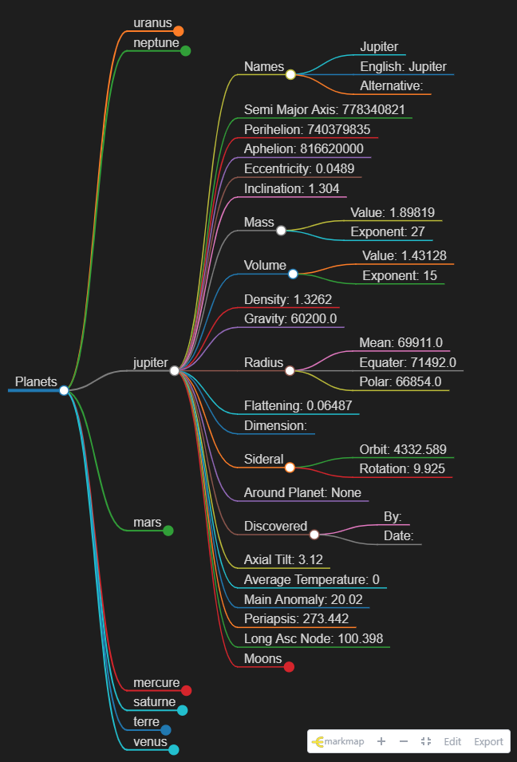
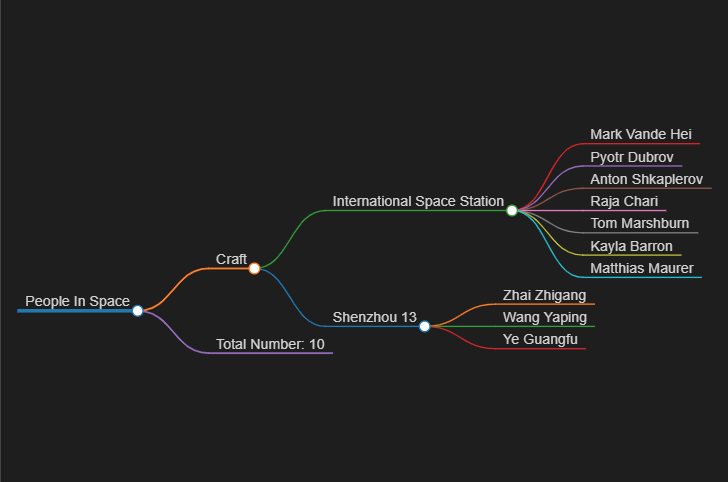

# Jupyter

Mind Maps of Space





## Introduction 

Using various APIs Jupyter collects JSON data and then uses Jinja2 templates to create markdown files. Using the markmap VS Code extension these markdown files render as mind maps! 

## NASA API Key 

Please visit [NASA](api.nasa.gov)

And register for an API key. Once you have your key please add it to the .env file

## Setup

I recommend running Jupyter in a Python virtual environment. This will help keep your host system clean and allow you to have multiple environments to try new things. If you are not using a virtual environment, start at the download/clone step below.

You will also need Python 3 and venv installed on your host system.

In your project directory, create your virtual environment
``` console
python3 -m venv env
```
Activate (use) your new virtual environment (Linux):
``` console
source env/bin/activate
```
Pip Install the package using pip install jupyter_mindmaps:

``` console
(env)pip install jupyter_mindmaps
```

Make a directory to hold your output
``` console
(env)mkdir Space Mindmaps
(env)cd Space Mindmaps
```

## Run the code help

```console
(env)jupyter_mindmaps --help
```


## Run the code passing the key

```console
(env)jupyter_mindmaps --token { your NASA token }
```
## Run the code interactively

```console
(env)jupyter_mindmaps
NASA Token: { your NASA token }
```

## Run the code using an environment variable

```console
(end) export TOKEN={ your NASA token }
(env)jupyter_mindmaps

```
## View the Mindmaps 

Type code . to launch VS Code in the folder 

Install the markmap VS Code Extension


Open the markdown file and click the "Open as markmap" 

## API List
The following files are created from the various APIs. The Space.md file contains <b>all</b> APIs. 


Original background photo credit 
[Photo](https://www.nasa.gov/audience/forstudents/k-4/dictionary/Solar_System.html)
